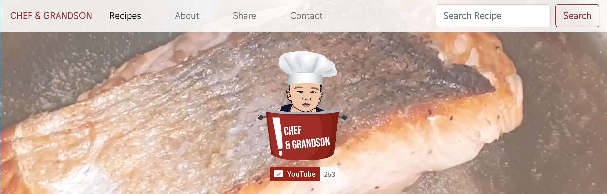

# Inspirational Recipe Book

👩‍🍳👨‍🍳📚[Inspirational Recipe Book deployed on Heroku](https://inspirational-recipebook.herokuapp.com) is a further development of my previous front-end development project – [Chef &amp; Grandson](https://minirazs.github.io/project1_inspirationalpursuits/). Back-end development is done to make it a more robust data-centric web application.

The aim of Inspirational Recipe Book is to promote the Chef &amp; Grandson YouTube channel, increase YouTube subscription and increase its respective recipe viewership and interactions with online users through recipe creation and links to social media accounts. Eventually, the site is meant to be developed to include user account logins and user reviews _(refer to features to be implemented section below)._

## UX

The web application is meant to be clean, intuitive and easy to manoeuvre; which is reflective of the video recipe&#39;s style and that is simple-to-follow.

## UI

_Colour_

The main colours used in the site are Red, White and Orange. Red and White from the Logo.

_Font_

Thasadith is a minimalistic, modern font that gives off a simple, clean feel.

_Wireframe_

The wireframe for the home page [can be found here](https://github.com/Minirazs/project3_inspirationalrecipebook/blob/master/static/wireframe/wireframe_home.jpg). The overall idea is to make the web application user-friendly and intuitive to navigate:

1. Navbar on top with all the links to all the pages, a simplified search bar on it
2. The middle section of the site has a plain white background starting with advanced search criteria (there&#39;re three criteria) and to display the search results prominently.
3. The footer of the site has links similar to the navbar, a link to my Github and links to other social media pages of Chef &amp; Grandson.

## User Stories

- The user wants to learn cooking and search for a recipe by name, cuisine type or meal type and want the search results shown quickly and prominently.
- The user wants to share his or her own recipe to the community and submit the recipe on the site.
- The user who has created a recipe previously and want to edit or delete the recipe. _(Note: Chef &amp; Grandson&#39;s recipes cannot be edited nor deleted. Options are not shown to user)_
- The user wants to understand more about the Chef &amp; Grandson brand and can read their background from About page.
- The user has questions about cooking or the recipes and can message and contact the Chef &amp; Grandson administrator to find out more.
- The user wants to interact with the Chef &amp; Grandson brand more via other social media platforms such as Facebook, Instagram and YouTube.
- The user wants to subscribe to the YouTube channel by clicking on the subscription button on the site.

## Features

- Navbar links to all pages on the site – Recipe (Home page), About, Share (Create Recipe) and Contact
- The first simplified search bar on the navbar, &#39;_Search Recipe by name&#39;,_ by typing and submitting will display results from recipe name



- In the middle section of the site, below the video banner, it starts with an introduction of the site and it&#39;s the advanced search bar with 3 criteria that can be chosen and entered. The search results will be based on 3 criteria combined.
- Upon clicking on the image or name on the card (search display result), it will lead to the individual recipe page showing the recipe name, its description, its ingredients and measurements, its directions, video url input, image uploader widget and contributor information.
- After creating the recipe, the user can choose to edit or delete the recipe. Deletion can only be processed if the user can correctly enter the contributor email that he or she has entered during recipe creation.
- For Edit and Delete features of the recipes, by default if the recipes are by the Administrator (i.e. the Chef &amp; Grandson team), they cannot be edited or deleted.
- Flash messages – to prompt the user on whether certain actions are successfully or unsuccessfully completed. E.g. edited successfully or deleted successfully
- YouTube API button on the video banner and in the Footer allow the user to quickly subscribe to the YouTube channel, increasing conversion rate.
- Embedded Instagram feed in the About Us section – the user can view the brand&#39;s posts in the carousel. The carousel automatically switches the posts every few seconds. Once a post is clicked on, it will expand for an enlarged view. It is also linked to its original post and will open in a new tab.
- Footer consists all the links in navbar for user to quickly navigate around the site.
- All the links and images – when hovered over, the links appear in orange. When the cursor is stopped and hovered over the object for a few seconds, text (in the title) appears to describe it.
- Mobile responsive – when device and screen size changes, the elements in the site change to optimize the user&#39;s viewing experience.

### _Features that can be improved / Future Plans_

1. To have an additional feature for Administrator of the site to check, **validate inputs** and approve the recipe created by an external user. This is to minimise errors such as typo or styling issues.
2. To **dynamically generate additional input fields** of the Ingredient and Directions of the recipe creation page with a click of a button (+) so as not to be restricted by the need to type semicolon (;) behind each ingredient/ step.
3. To **enable user login** using their social media accounts like Facebook or Google to create, edit, delete and save recipes to their account.
4. To **enable user review** to increase interactions with user by allowing them to upload recipes that they have made by following the steps and their comments
5. **More Cuisine options** such as French, Japanese, Korean and Meal Type options can be introduced eventually as popularity for the site increases
6. To **delete incorrect image** uploaded to recipe page within 10 minutes after being uploaded.
7. To make **image** upload a **required** input during Create recipe.
8. **Sharing** of Recipes via social media icons (Email, Facebook, Pinterest etc.)
9. To **display** a &#39; **No search found&#39;** message when there is no corresponding search results based on the criteria entered.

## Technologies Used

- HTML5
- CSS3
- JavaScript
- JQuery
- Python
- Flask
- [Jinja 2.11.2](https://jinja.palletsprojects.com/en/2.11.x/)
- [MongoDB Atlas](https://www.mongodb.com/cloud/atlas) cloud hosted database
- [pymongo 3.11.0](https://pymongo.readthedocs.io/)
- [dotenv](https://pypi.org/project/python-dotenv/)
- [Cloudinary](https://cloudinary.com/)
  - for image upload widget, to store images on cloud database
- [YouTube URL matching/capturing](https://regexr.com/3dj5t)
  - regex (form validation)
- [Youtube API](https://developers.google.com/youtube/youtube_subscribe_button)
  - YouTube embedded subscription button which allows the users to subscribe directly to the channel. This allows for much quicker conversion.
- [Curator.io v2.0](https://curator.io/)
  - The Instagram feed in the form of a carousel under the About page is aggregated by this tool. It is a quick and simple way of displaying Instagram feed nicely in the site.
- [Bootstrap 4](https://getbootstrap.com/)
  - The project uses Bootstrap framework for basic, quick, customisable design codes and allows the site to be mobile responsive.
- [Favicon.io](https://favicon.io/favicon-converter/)
  - Favicon is created from this site.
- [Font Awesome v5.0.0](https://fontawesome.com/)
  - The chevron icon used in the scroll-up button is from Font Awesome
- [Custom list number styling](https://css-tricks.com/custom-list-number-styling/)
  - CSS styling for the ordered list numbering on single recipe page
- [Am I Responsive?](http://ami.responsivedesign.is/)
  - To check the mobile responsiveness of the site and create screen.gif
- [Word to markdown converter](https://word2md.com/)
  - To convert word doc into Markdown for use in README.md
- [Google Font](https://fonts.google.com/)
  - Fonts used
- [Visual Studio Code (VSC)](https://code.visualstudio.com/) and its extensions like Live Server and Prettier
- [Github](https://github.com/)
- [Heroku](https://www.heroku.com/)
- [Adobe Creative Suite](https://www.adobe.com/sea/creativecloud.html) – UX, Photoshop
- [W3C Markup Validation service](https://validator.w3.org/)
- [W3C CSS Validation Service](https://jigsaw.w3.org/css-validator/)
- [JSHint, Code Analysis tool for Javascript](https://jshint.com/)

## Programming Methodologies

- .env file stores environment variables so database credentials are hidden from public view.

## Database Design

1 MongoDB collection is created and utilized due to simplicity of the project.

A sample Recipes document (show 1 recipe):
```
{

    _id: ObjectId(“5f9e6b91d895188245e836be”),
    name: "Hainanese Chicken Rice",
    description: " Hainanese Chicken Rice is an extremely mouthwatering dish with tender, succulent, boiled chicken drizzled with savoury sauces, served with fragrant chicken rice, and of course Hainanese chili sauce, dark soy sauce and ginger sauce.”,
    servings: "4",
    ingredients: Array
    0 : "1.8-2kg whole kampong chicken"
    1 : "7 garlic cloves, peeled and pound"
    2 : "3 pcs pandan leaves, tied and pound x2"
    3 : "7 slices of ginger"
    4 : "2 tsp salt to season chicken"
    5 : "Half tsp white pepper powder"
    6 : "550ml chicken stock, strained"
    7 : "500g rice"
    8 : "1 chicken cube"
    9 : "Half tsp salt to cook rice"
    10 : "  Chicken Seasoning: 1 tbsp Sugar,1 tbsp Hot water,2 tbsp Sesame oil,2 tbsp Light soy sauce,Mix together”,

    directions: Array
    0: "Pound the Ginger, Pandan Leaves"
    1: "Stuff garlic and ginger into the chicken"
    2: "Sprinkle salt"
    3: "Stuff pandan leaves, Salt, White Pepper"
    4: "Blanche the chicken in boiling water four times"
    5: "Add pandan leaves and ginger"
    6: "Cover and reduce to mid-low heat. Simmer for 30min."
    7: "Take out the chicken and soak in cold water"
    8: "Once it is completely cooled, debone"
    9: "Pour chicken seasoning"
    10: "Add the bones back into the chicken stock. Simmer for another 30 mins"
    11: "Filter 550ml of chicken stock"
    12: "Pour the stock into rice cooker"
    13: "Add in ginger, garlic, pandan leaves and chicken cube"
    14: "Cook the rice"
    15: "Remove garlic, ginger & leaves"
    16 : "Enjoy!",

    Cuisine : Array
    0 : "chinese"
    1 : "hainanese",

    meal_type : "maincourse",

    media: https://www.youtube.com/embed/fTxrAdIyo88,

    image: "http://res.cloudinary.com/minirazs/image/upload/v1605675692/chickenric...",
    contributor: "Chef & Grandson",
    email:"happy@email.com",

}
```
For future development, 2 other collections – User and Reviews – can be created and implemented:

1. For User collection, it can store user id, their personal details, their saved recipes (favourites).
2. For Review collection, it can store user&#39;s reviews or comments for each recipe and uploaded images of their own work.

## Testing

The initial testing phase was to put the HTML code, CSS code, and Javascript code through the W3C, Jigsaw, and JSHint validator tools to check and rectify issues.

Next, using the browser&#39;s Inspect tool and Live Server extension on VSC to preview the site ensures that the site is mobile responsive and all content, such as video banner, buttons, and links, is correctly and displayed on different screen sizes, namely mobile (below 480px), tablet (between 768px to 1024px) and laptop (above 1024px):

- iPad (portrait and landscape mode)
- iPad Pro (portrait and landscape mode)
- Kindle Fire (portrait and landscape mode)
- Galaxy S9/S9+
- iPhone X/XS
- iPhone 6/7/8
- iPhone 5/SE
- Pixel 2
- Moto G4
- Surface Duo
- Galaxy Fold

These steps are repeated in the testing on major web browsers, Chrome and Firefox:

| # | Event | Expected Outcome | Actual Outcome |
| --- | --- | --- | --- |
| 1 | Click on Recipes link on navbar and in footer, and CHEF AND GRANDSON on navbar | Links to Homepage | As expected |
| 2 | Click on About link on navbar and in footer | Links to About page | As expected |
| 3 | Click on Share link on navbar and footer | Links to Create Recipe page | As expected |
| 4 | Click on Contact link on navbar and footer | Links to Contact Us page | As expected |
| 5 | Enter search by any or all or a combination of the 3 criteria, based on the recipe name, cuisine type and meal type | Recipes that match the search criteria will be shown.Dummy recipes have been created (have already been deleted) to test that recipes are shown correctly based on the criteria | As expected |
| 6 | Enter search by recipe name entry in navbar search bar | Recipes that consist of the entry value are shown together on a page | As expected |
| 7 | Input YouTube embed video URL in the Create or Edit recipe pages | Only URL that adheres to the pattern is permitted and saved.Only URL that begins with[_https://www.youtube.com/embed/_](https://www.youtube.com/embed/)is accepted. Else, user can choose not to type any URL and the video will not be displayed._pattern_=&quot;^(https:\/\/)(www\.)(youtube\.com)(\/(embed\/))([\w\-]+)(\S+)?$&quot; | As expected |
| 8 | Upload Image by selecting 1 file from Local drive | Selected Image upload successfully to Cloudinary. | As expected |
| 9 | Crop Image in Cloudinary image widget | Image cropped to the size desired by the user and uploaded successfully | As expected |
| 10 | Delete incorrect image uploaded at Create or Edit page | Incorrect image will be deleted from Cloudinary. | Not implemented yet. Only can upload the correct image to replace it |
| 11 | In individual recipe page created by the user, click on Edit button to edit the recipe | Will link to the Edit recipe page for user to input which fields that they want to change and entries are saved. | As expected |
| 12 | In individual recipe page created by the user, click on _Delete_ button to delete the recipe | Will link to the Delete recipe page for user to choose if they want to proceed with deletion or cancel and go back to Home page. | As expected |
| 13 | On the delete page, to click on _Cancel Delete_ button to abort deletion | Will link back to Home Page if the user cancel deletion | As expected |
| 14 | On the delete page, to click on _Confirm Delete_ button to abort deletion | Prompt user to enter Contributor email to process deletion. Only the correct email will authorise the deletion; if incorrect email is entered, deletion will not happen. | As expected |
| 15 | Click on Facebook, Youtube, Instagram social media icons | Will link to the respective Chef &amp; Grandson social media pages | As expected |

_Youtube API button in Header Video_
At times the YouTube API subscribe button in the Header video will appear positioned to the left and not directly in the middle. The correct position is in the middle of the header's video. However, by refreshing the screen, the API button will position correctly in the middle of the header video. It is unsure why the button does not appear in the middle at times and this error is corrected with refreshing the page.


_Potential issues or limitations with Recipe text inputs_

For the text inputs such as Description, Ingredients and Directions of each recipe, it is heavily reliant on the user to phrase, type and check the sentences accurately as the site does have an additional steps to verify and validate user inputs yet. As mentioned in the _Features that can be improved_ section, there can be an extra step by the Administrator to verify, validate and correct the sentences of each recipe before approving the recipe to be shown online.

In the Ingredients and Directions text input boxes, it is important for the user to follow the instruction to type a semicolon (;) behind every ingredient or step in order for the Python code to separate and put each of them in an array. The benefit of putting them in an array will allow each ingredient / step to be displayed nicely on the recipe page.

A potential way to bypass this is to eventually implement a jQuery code to dynamically generate additional input fields of the Ingredient and Directions with a click of a button. This will allow the user to control and decide how many ingredients or steps they want to input; i.e. 1 step is typed into 1 input field. This will enhance user experience.

_Potential Hiccups / Errors with Cloudinary_

At times during recipe creation page, the Cloudinary image upload widget may run into a 403 access denied error. However, by refreshing the page and trying again in re-typing the recipe creation form, the entry can be successfully created.

As a result, I have tried to duplicate this image upload code in a standalone new route and a separate html template page (with image uploader as the only input, without other fields), the image widget can always work properly without triggering this access denied error. Hence, it may be concluded that when this widget is placed in a Form with many other Form entries, it is unable to function properly.

However, in this recipe creation context, it does not make a good user experience for multiple opening of web pages in order to upload an image, and so I have kept the image uploader within the Recipe Creation Form page.

Cloudinary only allows for deletion of assets on the client-side for a limited time of 10 minutes after being uploaded. And so, at Recipe Edit page, the older image URL can be replaced by the newly uploaded image URL and saved in MongoDB. However, the old image asset can only be deleted by the Administrator within the Cloudinary account at the server-side.

_Image to be made required_

The image input in form is hidden and unable to make it required, since this is controlled by Cloudinary.

##


## Deployment

**Code for the project was committed to GitHub:**

Github is used for version controlling and all the commits for this project found at this link: [https://github.com/Minirazs/project3\_inspirationalrecipebook](https://github.com/Minirazs/project3_inspirationalrecipebook)

The site is automatically updated when new commits are pushed to the master branch from VSC or GitPod using the Source Control: Git panel on the left of the console.

1. Once there are any changes made to the files, individual files are staged by clicking on the &#39;+&#39; sign in the Source Control: Git panel
2. Enter relevant message to the changes into the bar and press Ctrl Enter to commit to GitHub

**Deployment to Heroku via GitPod:**

1. Log into Heroku by typing into the bash terminal: ```heroku login -i```
2. Create a new heroku app: ```heroku create <app-name>```
3. Check correct remotes added: ```git remote -v```
4. Install gunicorn: ```pip3 install gunicorn```
5. Create a name file named &quot; **P** rocfile&quot; in the same directory as app.py
6. Enter: ```web gunicorn <python file name without '.py'>```
7. Create requirements file: ```pip3 freeze --local requirements.txt```
8. Using bash, commit all new changes to GitHub: ```git add .``` then ```git commit -m "message"```, and then git push to Origin ```git push```
9. Push to Heroku: ```git push heroku master```

On Heroku website:

- Log into [Heroku](https://id.heroku.com/login) dashboard, go to settings and set environment variables for ```SECRET_KEY = <your own key>```, ```MONGO_URI = <your MongoDB URI>```
- Open App to view the web application!

## Credits

## Tools &amp; Tech used

Special thanks to the developers and tech creators for sharing freely their code and tools that are used in this site creation. 🤗🙌 They are listed in the Technologies section above.

## Heroku Deployment steps

Special thanks to [Paul Chor](https://github.com/kunxin-chor) for providing the deployment steps that are shown above.

## Images, Content &amp; Logo 📷

- Mainly designed and belonged to Chef &amp; Grandson
- Some images used for test-recipes from Pexel.com